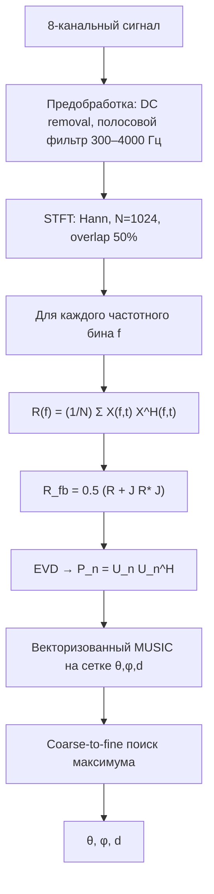

# MUSIC — локализация источника звука (near-field, 8 каналов)

Широкополосная реализация алгоритма **MUSIC** (*Multiple Signal Classification*) для оценки направления и расстояния до источника звука по синхронной 8-канальной записи. Поддерживаются проекты **Audacity** (`.aup`) и многоканальные **WAV/FLAC**.

Подробное ТЗ: [`instruction.md`](instruction.md).

---

## Структура репозитория

| Файл | Описание |
|------|----------|
| `music_core.py` | Ядро алгоритма (STFT, ковариация, FB-усреднение, EVD, векторизованный MUSIC) |
| `music.py` | CLI: один файл, пакетная обработка, визуализации |
| `music_visualize.py` | Сохранение диагностических графиков (PNG) |
| `music_batch.py` | Обёртка для старого интерфейса `--audio-dir` |
| `requirements.txt` | Зависимости Python |
| `audio/` | Примеры записей (`.aup` + каталоги `*_data`) |

---

## Установка

```bash
python -m venv .venv
.venv\Scripts\activate          # Windows
# source .venv/bin/activate     # Linux/macOS

pip install -r requirements.txt
```

Требуется **Python 3.10+**.

---

## Быстрый старт

### Один файл

```bash
python music.py audio/A1_CH_10_20.aup
```

Вывод: азимут (°), угол места (°), расстояние (м). Для имён вида `A1_CH_10_20` в CSV также пишутся эталонные значения из имени файла (10°, 0.20 м).

### Пакетная обработка → CSV

```bash
python music.py --batch audio --output results.csv
```

Альтернатива (совместимость):

```bash
python music_batch.py --audio-dir audio --output results.csv
```

### Подробные визуализации

```bash
python music.py audio/A1_CH_10_20.aup --visual --visual-dir viz_out
python music.py --batch audio --visual --visual-root visualizations
```

В каталоге появятся графики: STFT по каналам, собственные значения `R_fb`, тепловые карты спектра MUSIC, 1D-срезы, 3D-геометрия, полярный срез, сводка.

---

## Параметры CLI

| Параметр | По умолчанию | Описание |
|----------|--------------|----------|
| `audio_file` | — | Путь к `.aup` / `.wav` / `.flac` |
| `--batch DIR` | — | Обработать все `.aup`/`.wav`/`.flac` в каталоге |
| `--output FILE` | `music_results_YYYYMMDD_HHMMSS.csv` | Имя CSV в пакетном режиме |
| `--speed-of-sound` | 343 | Скорость звука \(c\), м/с |
| `--block-start` | 0 | Начало фрагмента (отсчёты) |
| `--block-len` | 88200 | Длина фрагмента (~2 с при 44.1 кГц) |
| `--num-sources` | 1 | Число источников \(K\) |
| `--visual` | выкл. | Сохранить диагностические PNG |
| `--visual-dir` | `visualizations/<имя_файла>` | Каталог визуализаций (один файл) |
| `--visual-root` | `visualizations` | Корень визуализаций в `--batch` |
| `--full-3d` | выкл. | Полная 3D-сетка \((\theta,\phi,d)\) по ТЗ |

---

## Геометрия микрофонной решётки

Используется **линейная** 8-канальная решётка вдоль оси \(X\) (координаты из исходного `music.py`):

| Микрофон \(m\) | 1 | 2 | 3 | 4 | 5 | 6 | 7 | 8 |
|----------------|---|---|---|---|---|---|---|---|
| \(x_m\), м | −0.14 | −0.10 | −0.06 | −0.02 | 0.02 | 0.06 | 0.10 | 0.14 |
| \(y_m, z_m\) | 0 | 0 | 0 | 0 | 0 | 0 | 0 | 0 |

Центр решётки — начало координат. Максимальный «радиус» \(R \approx 0.14\) м.

### Планарный режим (по умолчанию)

Для записей с источником в плоскости решётки используется 2D-модель (источник на высоте \(z=0\)):

\[
x = d\sin\theta,\quad y = d\cos\theta,\quad z = 0
\]

Азимут \(\theta\) — угол от оси **+Y** (совпадает с разметкой в именах файлов `A1_*_<угол>_<дистанция>`). Угол места в выходе фиксируется \(\phi = 90°\) (источник в плоскости XY).

### Полный 3D-режим (`--full-3d`)

Сферические координаты по [`instruction.md`](instruction.md):

\[
x = d\cos\theta\sin\phi,\quad y = d\sin\theta\sin\phi,\quad z = d\cos\phi
\]

- \(\theta \in [0°, 360°)\) — азимут  
- \(\phi \in [0°, 90°]\) — угол места (\(0°\) — нормаль к плоскости решётки)  
- \(d \in [0.2, 3.0]\) м — расстояние  

---

## Математическая модель

### Расстояние до микрофона

Для гипотетического источника в точке \((d,\theta,\phi)\) расстояние до \(m\)-го микрофона:

\[
D_m(\theta,\phi,d) = \sqrt{(x-x_m)^2 + (y-y_m)^2 + (z-z_m)^2}
\]

### Вектор управления (near-field)

Для частоты \(f\) и скорости звука \(c \approx 343\) м/с:

\[
\mathbf{a}(f,\theta,\phi,d) = \left[\frac{d}{D_1}e^{-j\frac{2\pi f}{c}(D_1-d)},\ \ldots,\ \frac{d}{D_8}e^{-j\frac{2\pi f}{c}(D_8-d)}\right]^T
\]

Множитель \(d/D_m\) компенсирует радиальное затухание в ближней зоне.

### Численно устойчивый знаменатель

Вместо прямого \(\mathbf{a}^H\mathbf{P}_n\mathbf{a}\) используется сумма квадратов норм проекций:

\[
\text{denom} = \sum_{m} \left|[\mathbf{P}_n\mathbf{a}]_m\right|^2 = \|\mathbf{P}_n\mathbf{a}\|_2^2
\]

---

## Пошаговый алгоритм



### 1. STFT

- Длина кадра: **1024** отсчёта  
- Перекрытие: **50%** (512 отсчёта)  
- Окно: **Hann**  
- Рабочая полоса: **300–4000 Гц**

### 2. Кросс-спектральная матрица и FB-усреднение

\[
\mathbf{R}(f) = \frac{1}{N}\sum_{t=1}^{N} \mathbf{X}(f,t)\mathbf{X}^H(f,t)
\]

\[
\mathbf{R}_{fb}(f) = \frac{1}{2}\left(\mathbf{R}(f) + \mathbf{J}\mathbf{R}^*(f)\mathbf{J}\right)
\]

\(\mathbf{J}\) — exchange-матрица \(8\times8\) (единицы на побочной диагонали). Сглаживает когерентные отражения и помехи.

### 3. Собственное разложение

\[
\mathbf{R}_{fb} = \mathbf{U}\mathbf{\Lambda}\mathbf{U}^H
\]

Первые \(K\) собственных векторов — сигнальное подпространство, остальные \(8-K\) — шумовое. Проектор на шум:

\[
\mathbf{P}_n(f) = \mathbf{U}_n\mathbf{U}_n^H
\]

По умолчанию \(K=1\).

### 4. Широкополосный спектр MUSIC

\[
P_{MUSIC}(\theta,\phi,d) = \sum_{f \in \mathcal{F}} \frac{1}{\|\mathbf{P}_n(f)\,\mathbf{a}(f,\theta,\phi,d)\|_2^2 + \varepsilon}
\]

Суммирование по всем бинам \(f\) в полосе 300–4000 Гц. Сетка просчитывается **векторизованно** (NumPy, без циклов по углам).

### 5. Coarse-to-fine

| Этап | Азимут / угол | Расстояние |
|------|----------------|------------|
| **Coarse** | шаг 5° | шаг 0.2 м |
| **Fine** | ±10° от пика, шаг 1° | ±0.2 м от пика, шаг 0.01 м |

В планарном режиме уточняются только \(\theta\) и \(d\).

---

## API (Python)

```python
from music_core import music_localization, music_octagon_localization, load_audacity_or_wav

X, fs = load_audacity_or_wav("audio/A1_CH_10_20.aup")  # shape: (8, n_samples)

# Основной интерфейс
result = music_localization(X[:, :88200], fs, num_sources=1)
print(result.azimuth_deg, result.elevation_deg, result.distance_m)

# Интерфейс из ТЗ (азимут в системе instruction: от +X)
az, el, dist = music_octagon_localization(X[:, :88200], fs, R=0.14)
```

---

## Формат CSV (пакетный режим)

| Столбец | Описание |
|---------|----------|
| `filename` | Имя файла |
| `azimuth_deg` | Оценка азимута |
| `elevation_deg` | Оценка угла места |
| `distance_m` | Оценка расстояния, м |
| `gt_azimuth_deg` | Эталон из имени (`A1_*_<θ>_<d>`) |
| `gt_distance_m` | Эталон: последнее число / 100 (напр. `20` → 0.20 м) |
| `error` | Текст ошибки (пусто при успехе) |

---

## Загрузка Audacity

Проекты `.aup` (Audacity 2.x) читаются из XML; сэмплы — из блоков `.au` с заголовком `dns.` (32-bit float PCM после 24-байтного заголовка). Файлы ищутся рекурсивно в `<имя_проекта>_data/`.

Формат `.aup3` не поддерживается — экспортируйте многоканальный WAV.

---

## Ограничения и замечания

1. **Линейная решётка** слабо разделяет дальность и зеркальные направления; для тестовых записей включён планарный режим. Для произвольного 3D используйте `--full-3d` (и по возможности решётку с апертурой по двум осям).
2. **Оценка расстояния** на линейной решётке менее устойчива, чем азимут; при \(d \to 0.2\) м спектр часто имеет максимум у нижней границы сетки из-за члена \(d/D_m\).
3. Минимальная длина фрагмента — **1024** отсчёта (один кадр STFT).
4. Ожидается **ровно 8** синхронных каналов.

---

## Зависимости

- `numpy` — матричные операции  
- `scipy` — STFT, фильтрация  
- `matplotlib` — визуализации (`--visual`)  
- `soundfile` — чтение WAV/FLAC  

---

## Лицензия и ссылки

Реализация по внутреннему ТЗ [`instruction.md`](instruction.md).  
Классический MUSIC: Schmidt, R. O. (1986). *Multiple emitter location and signal parameter estimation.*
