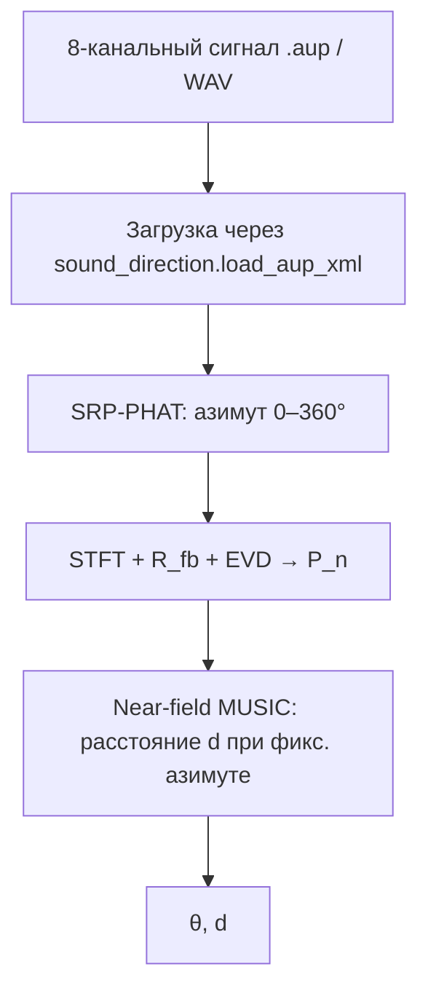

# MUSIC — локализация источника звука (8 каналов, круговая решётка)

Широкополосная локализация источника звука по синхронной 8-канальной записи: **направление** оценивается методом **SRP-PHAT** (как в `sound_direction.py`), **расстояние** — near-field **MUSIC** при фиксированном азимуте. Поддерживаются проекты **Audacity** (`.aup`) и многоканальные **WAV/FLAC**.

Подробное ТЗ (полный 3D-MUSIC): [`instruction.md`](instruction.md).

---

## Структура репозитория

| Файл | Описание |
|------|----------|
| `music_core.py` | Ядро: загрузка, STFT, FB-усреднение, SRP-PHAT (азимут), near-field MUSIC (расстояние) |
| `music.py` | CLI: один файл, пакетная обработка, визуализации |
| `sound_direction.py` | Эталонный GCC-PHAT / SRP-PHAT и загрузка `.aup` (используется ядром) |
| `music_visualize.py` | Диагностические графики (PNG) |
| `music_batch.py` | Обёртка для старого интерфейса `--audio-dir` |
| `requirements.txt` | Зависимости Python |
| `audio/` | Примеры записей (`.aup` + каталоги `*_data`) |

---

## Установка

```bash
python -m venv .venv
.venv\Scripts\activate          # Windows
# source .venv/bin/activate     # Linux/macOS

pip install -r requirements.txt
```

Требуется **Python 3.10+**.

---

## Быстрый старт

### Один файл

```bash
python music.py audio/A1_S1_10_40.aup
```

Пример вывода:

```
Направление звука: 112.5°
(0° = правее центра массива, против часовой стрелки)
```

Для `A1_S1_10_20.aup` ожидаемый азимут — **135.0°** (при тех же настройках, что у `sound_direction.py`).

Сравнение только по направлению (GCC-PHAT):

```bash
python sound_direction.py audio/A1_S1_10_40.aup --no-plot
```

### Пакетная обработка → CSV

```bash
python music.py --batch audio --output results.csv
```

### Подробные визуализации

```bash
python music.py audio/A1_S1_10_40.aup --visual --visual-dir viz_out
python music.py --batch audio --visual --visual-root visualizations
```

---

## Параметры CLI

| Параметр | По умолчанию | Описание |
|----------|--------------|----------|
| `audio_file` | — | Путь к `.aup` / `.wav` / `.flac` |
| `--batch DIR` | — | Обработать все `.aup`/`.wav`/`.flac` в каталоге |
| `--output FILE` | `music_results_YYYYMMDD_HHMMSS.csv` | Имя CSV в пакетном режиме |
| `--speed-of-sound` | 343 | Скорость звука \(c\), м/с |
| `--block-start` | 0 | Начало фрагмента (отсчёты) |
| `--block-len` | 44100 | Длина фрагмента (1 с при 44.1 кГц) |
| `--num-sources` | 1 | Число источников \(K\) (для MUSIC по расстоянию) |
| `--visual` | выкл. | Сохранить диагностические PNG |
| `--visual-dir` | `visualizations/<имя_файла>` | Каталог визуализаций (один файл) |
| `--visual-root` | `visualizations` | Корень визуализаций в `--batch` |
| `--full-3d` | выкл. | Полная 3D-сетка \((\theta,\phi,d)\) по ТЗ |

---

## Геометрия микрофонной решётки

**8 микрофонов** на окружности диаметром **1 м** (радиус \(R = 0.5\) м), центр в начале координат, плоскость \(XY\):

\[
x_m = R\cos\frac{2\pi(m-1)}{8},\quad
y_m = R\sin\frac{2\pi(m-1)}{8},\quad
z_m = 0
\]

Та же конфигурация, что в `sound_direction.py`.

### Система углов (планарный режим, по умолчанию)

- Азимут **0°…360°**: **0°** — направление вдоль **+X** (правее центра массива), **против часовой стрелки**.
- Источник в плоскости решётки: \(x = d\cos\theta\), \(y = d\sin\theta\), \(z = 0\).
- В выходе `elevation_deg = 90°` (источник в горизонтальной плоскости массива).

> Числа в имени файла (`A1_S1_10_40` и т.п.) — разметка сцены/записи; **не обязаны** совпадать с углом SRP-PHAT. Для проверки направления ориентируйтесь на вывод `music.py` / `sound_direction.py`.

### Полный 3D-режим (`--full-3d`)

Сферические координаты по [`instruction.md`](instruction.md) — чистый широкополосный MUSIC на сетке \((\theta,\phi,d)\).

---

## Алгоритм (планарный режим)



### 1. Направление — SRP-PHAT

Для каждой пары микрофонов вычисляется **GCC-PHAT**; для кандидатов азимута \(\theta\) суммируется корреляция при ожидаемой задержке в дальнем поле:

\[
\tau_{ij}(\theta) = -\frac{(x_i-x_j)\cos\theta + (y_i-y_j)\sin\theta}{c}
\]

Шаг сетки: **2°** (грубо) и **0.5°** (уточнение). Реализация — `sound_direction.srp_phat_angle`.

### 2. Расстояние — near-field MUSIC

На фрагменте применяются STFT (Hann, 1024, overlap 50%), полоса **300–4000 Гц**, FB-усреднование \(\mathbf{R}_{fb}\), шумовой проектор \(\mathbf{P}_n\). По сетке \(d \in [0.2, 3.0]\) м при найденном \(\theta\) максимизируется

\[
P_{MUSIC}(d) = \sum_f \frac{1}{\mathbf{a}^H(f,\theta,d)\,\mathbf{P}_n(f)\,\mathbf{a}(f,\theta,d)}
\]

с вектором управления ближней зоны (см. [`instruction.md`](instruction.md)).

---

## API (Python)

```python
from music_core import music_localization, load_audacity_or_wav

X, fs = load_audacity_or_wav("audio/A1_S1_10_40.aup")  # (8, n_samples)

result = music_localization(X[:, :44100], fs, num_sources=1)
print(result.azimuth_deg, result.distance_m)  # напр. 112.5, 0.2
```

---

## Формат CSV (пакетный режим)

| Столбец | Описание |
|---------|----------|
| `filename` | Имя файла |
| `azimuth_deg` | Азимут, ° (0° = +X, ПЧС) |
| `elevation_deg` | Угол места (в планарном режиме 90°) |
| `distance_m` | Расстояние, м |
| `gt_azimuth_deg` | Число из имени файла (если разобрано) |
| `gt_distance_m` | Последнее число / 100 |
| `error` | Текст ошибки |

---

## Загрузка Audacity

Проекты `.aup` (Audacity 2.x) читаются так же, как в `sound_direction.py`: XML + блоки `.au` (через `soundfile` или заголовок Sun AU), поиск файлов — `os.walk` от каталога проекта.

Формат `.aup3` не поддерживается — экспортируйте многоканальный WAV.

---

## Ограничения

1. **Расстояние** оценивается слабее азимута; спектр часто имеет максимум у нижней границы сетки \(d_{min} = 0.2\) м.
2. Минимальная длина фрагмента — **1024** отсчёта.
3. Нужно **ровно 8** синхронных каналов.
4. Для произвольного 3D используйте `--full-3d` (без SRP-PHAT на первом шаге).

---

## Зависимости

- `numpy`, `scipy` — обработка сигналов  
- `matplotlib` — визуализации (`--visual`)  
- `soundfile` — WAV/FLAC и чтение `.au` (в `sound_direction.py`)

---

## Ссылки

- ТЗ: [`instruction.md`](instruction.md)  
- MUSIC: Schmidt, R. O. (1986). *Multiple emitter location and signal parameter estimation.*  
- GCC-PHAT / beamforming: см. `sound_direction.py`
